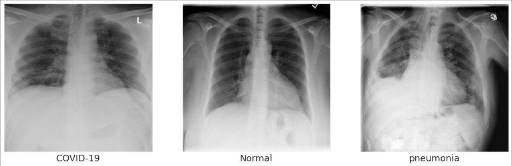

# Covid-19 Prediction With Convolutional Neural Network

In this project, normal, non-covid pneumonia and covid-19 detection studies will be carried out from chest x-ray pictures. Convolutional Neural Networks will be created and trained for prediction.

16,769 Chest X-Ray images were used for this project.
The training and test sets were separated from the data as 90-10. While training, we will allocate 20% of 90% as validation.

At the end of the training:

- **Train Performance : %95**
- **Test Performance : %86**

------

-------
You can use it to access the dataset

-[Dataset](https://drive.google.com/drive/folders/16c7dYcdy_mvfmAn7rVRzppd4Xu0QOjZj?usp=sharing)

or

You can find the summary of the dataset [here.](https://github.com/lindawangg/COVID-Net/blob/master/docs/COVIDx.md)